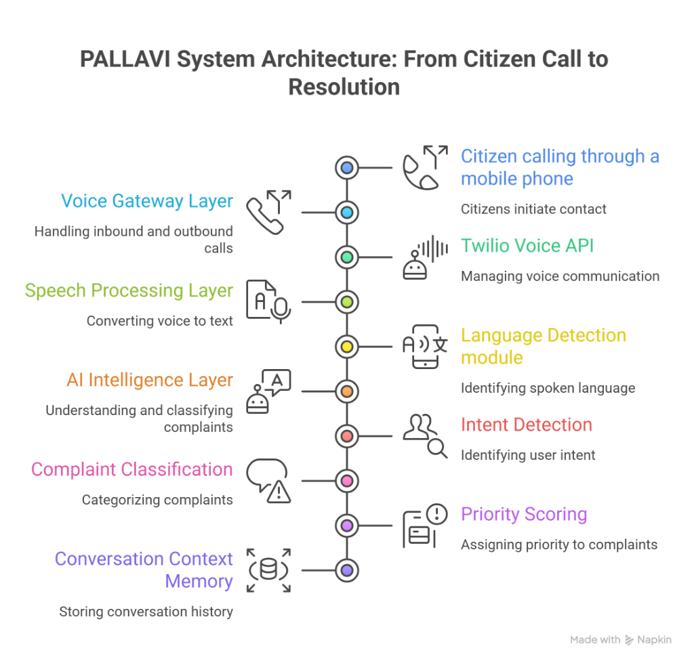
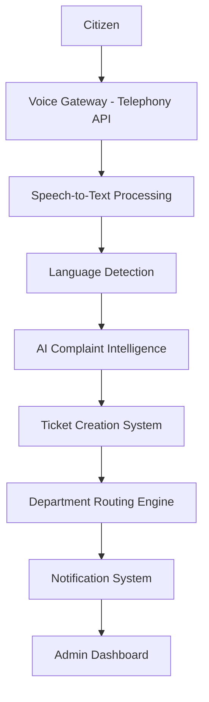

# PALLAVI – AI Public Service Voice Agent

AI-powered multilingual voice assistant for government grievance handling.

Built by **Team NOVACORE** for **India Innovates 2026 – Digital Democracy Track**

---

# Problem

Millions of citizens struggle to reach government helplines due to:

*   **Long waiting times**: Traditional call centers are often overwhelmed.
*   **Limited call center capacity**: Human operators are a bottleneck for massive populations.
*   **Language barriers**: India's linguistic diversity poses a challenge for centralized helplines.
*   **Lack of transparent complaint tracking**: Citizens often don't know the status of their grievances.

Rural citizens prefer **voice communication**, but existing systems are limited and inefficient.

---

# Solution – PALLAVI

PALLAVI is a **multilingual AI voice assistant** that allows citizens to call a government helpline and report complaints using natural speech.

The system automatically:

*   **Understands complaints**: Natural Language Understanding (NLU) identifies intent.
*   **Categorizes the issue**: Automatically maps grievances to departments.
*   **Creates a ticket**: Instant generation of tracking IDs.
*   **Routes the complaint**: Real-time assignment to the correct administrative officer.
*   **Notifies the citizen**: Multichannel updates via SMS, WhatsApp, and Voice.
*   **Tracks complaint resolution**: Full lifecycle management until closure.

The system works **24/7 without human operators**.

---

# System Architecture



### Architecture Flow

Citizen calls the helpline.




---

# Key Features

### 🎙️ Multilingual Voice Interaction
Citizens can speak in their **native language**. PALLAVI handles transitions between languages seamlessly.
Supported languages include:
*   Tamil, Hindi, Telugu, Malayalam, Kannada, English

### 🧠 AI Complaint Understanding
High-precision AI models detect:
*   **Intent**: What is the citizen asking for?
*   **Category**: Which service area does it belong to?
*   **Priority**: How urgent is the issue (Life-Safety vs Regular)?

### 🎫 Automatic Ticket Creation
Each complaint generates a unique ticket instantly.
- **Example**: `Ticket ID: SAN-2043` | `Category: Sanitation` | `Priority: Medium`

### 🏗️ Department Routing
Complaints are automatically routed to the responsible department using a regional organizational hierarchy.

| Complaint | Department |
| :--- | :--- |
| Water leakage | Municipal Water Supply |
| Garbage overflow | Urban Sanitation Management |
| Broken signal | Public Works (Roads) |
| Streetlight issue | State Electricity Board |

### 📱 Citizen Notifications
Citizens receive updates through a robust notification engine:
*   SMS | WhatsApp | Automated Voice Callbacks

---

# Admin Dashboard
Government officials monitor the system through a premium, data-dense dashboard.
*   **Live Call Monitoring**: Real-time AI audio stream visualization.
*   **Complaint Analytics**: Trend analysis and department performance metrics.
*   **Regional Heatmaps**: Geospatial visualization of grievance hotspots.
*   **SLA Alerts**: Instant notifications for breach of resolution targets.

---

# Demo Scenario

**Citizen Interaction**
> Citizen: *"There is garbage overflow near my house in Bengaluru Ward 4."*

**AI Processing**
- **Language**: English
- **Category**: Sanitation
- **Priority**: Medium
- **Department**: Municipal Sanitation Department

**Action**
- **Ticket**: `SAN-2043` Created.
- **Notification**: SMS sent to citizen.
- **Dashboard**: Incident appears on the ward heatmap.

---

# Project Scale & Technology

### Project Structure
```text
novacore-pallavi-ai
├── backend     # FastAPI Micro-Monolith
├── frontend    # React 18 Dashboard
├── docs        # Comprehensive Enterprise Manuals
├── data        # Massive 2.5K Record Corpus
├── scripts     # Simulation & Audit Tools
└── tests       # Full Integration Suite
```

### Technology Stack
- **Backend**: Python, FastAPI, SQLAlchemy, PostgreSQL, Redis
- **AI Layer**: Intent Models, Language detection, Sentiment Analysis
- **Voice**: STT/TTS Simulation, Telephony APIs
- **Frontend**: React, Tailwind CSS, Chart.js, Leaflet

---

# Vision
PALLAVI enables **voice-first digital governance**, ensuring that every citizen can communicate with government services easily. The platform is designed to scale across **district, state, and national levels**.

---

### Developed by **Team NOVACORE**
*Sri Eshwar College of Engineering*  
*India Innovates 2026*  

> "Every citizen deserves to be heard."
